# splizz

Splizz is a cross-platform Flutter app for splitting shared costs with friends, roommates, or small groups. It is designed for everyday use when you need to record expenses quickly, keep balances clear, and avoid manual calculations.

The app is built offline first. Data is stored locally so it remains usable without a connection, and it syncs through Supabase when online. That makes it suitable for both casual one-time trips and ongoing shared households or groups.

## Screenshots

<table>
	<tr>
		<td align="center">
			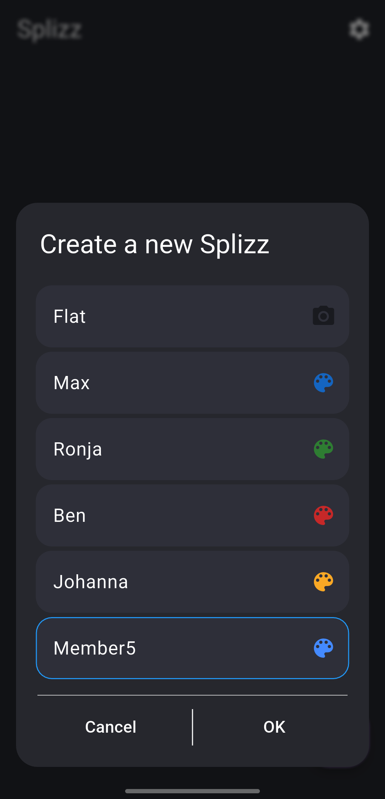
			 
			<strong>Create a group</strong>
			 
			Start a new group and add members.
		</td>
		<td align="center">
			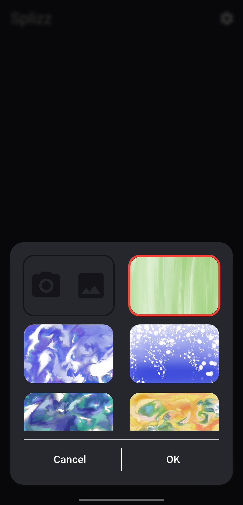
			 
			<strong>Choose a cover image</strong>
			 
			Pick a cover to identify the group.
		</td>
	</tr>
	<tr>
		<td align="center">
			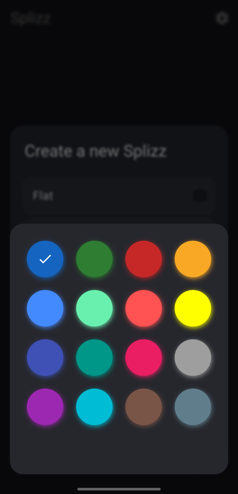
			 
			<strong>Set member colors</strong>
			 
			Use colors to keep participants easy to distinguish.
		</td>
		<td align="center">
			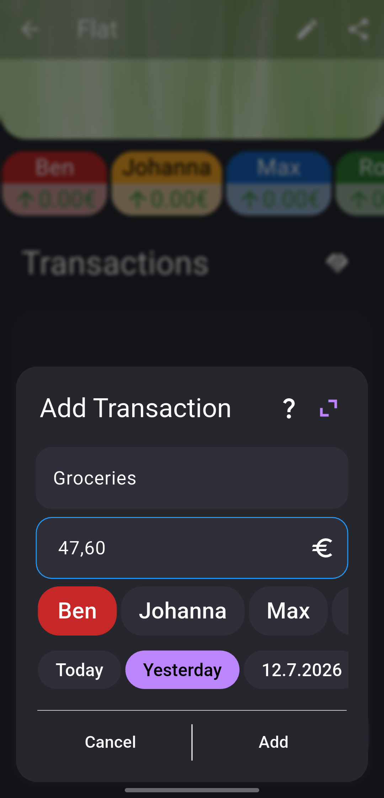
			 
			<strong>Add transaction</strong>
			 
			Enter title, amount, date and person who payed.
		</td>
	</tr>
	<tr>
		<td align="center">
			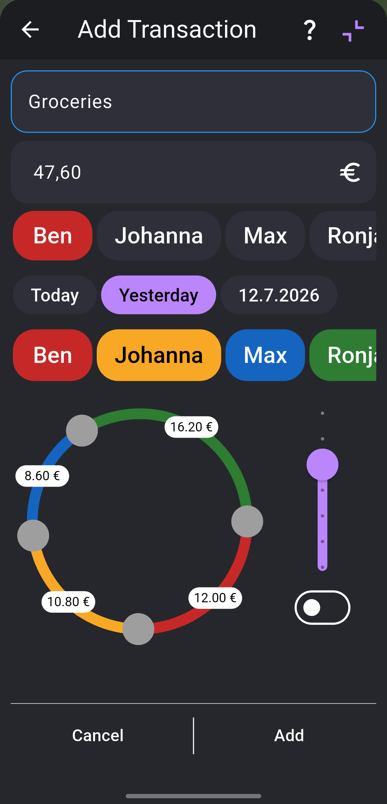
			 
			<strong>Additional settings for a transaction</strong>
			 
			Select participating members, and split details.
		</td>
		<td align="center">
			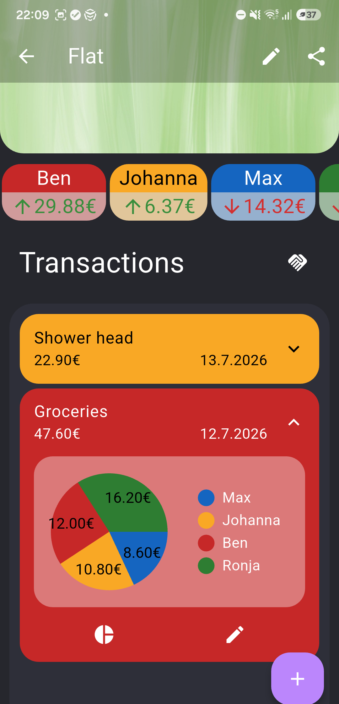
			 
			<strong>Transaction overview</strong>
			 
			Review balances and expense breakdowns.
		</td>
	</tr>
	<tr>
		<td align="center">
			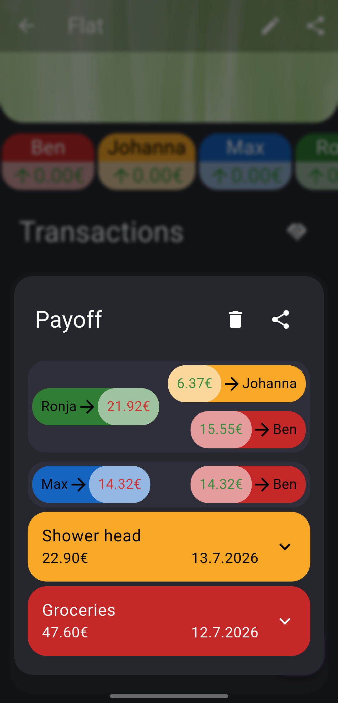
			 
			<strong>Payoff summary</strong>
			 
			Settle balances between participants.
		</td>
		<td align="center">
			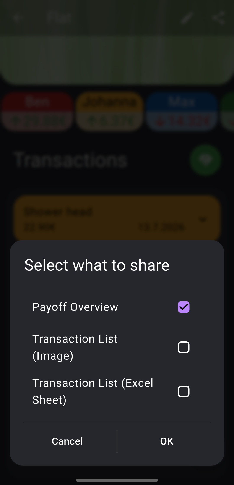
			 
			<strong>Share options</strong>
			 
			Export a payoff overview or transaction list.
		</td>
	</tr>
	<tr>
		<td align="center">
			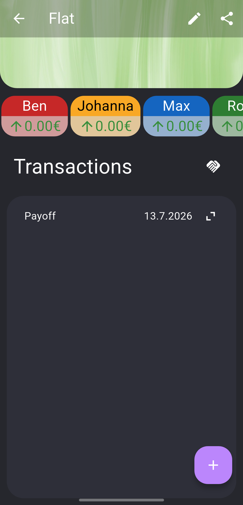
			 
			<strong>Group dashboard</strong>
			 
			See member balances and recent transactions.
		</td>
		<td align="center">
			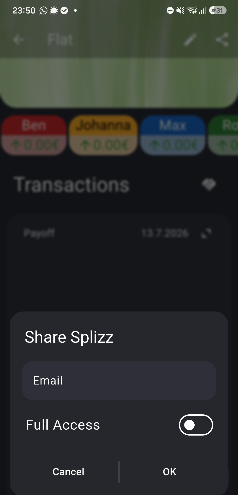
			 
			<strong>Share</strong>
			 
			Choose with whom you want to share the list.
		</td>
	</tr>
	<tr>
		<td align="center">
			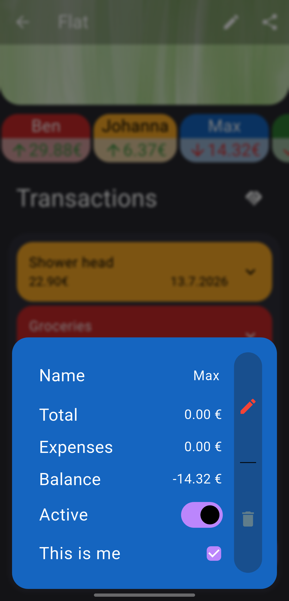
			 
			<strong>Member details</strong>
			 
			Review totals and edit a participant.
		</td>
		<td align="center">
			
			 
			<strong>Editor</strong>
			 
			Replace the group image and title.
		</td>
	</tr>
	<tr>
		<td align="center">
			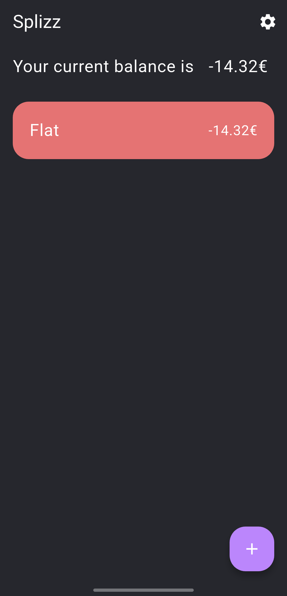
			 
			<strong>Current balance overview</strong>
			 
			A compact home screen with the overall balance.
		</td>
		<td align="center">
			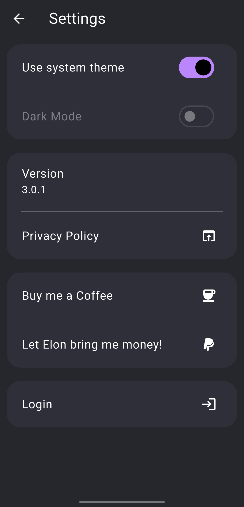
			 
			<strong>Settings</strong>
			 
			Adjust theme, account, and app information.
		</td>
	</tr>
</table>

## Features

- Track shared expenses and record transactions
- Use the app offline-first or offline-only
- Sync data across devices when online
- Sign in with Supabase authentication
- Keep a consistent experience across mobile platforms

## WiP
- Add web support
- Take pictures of receipts to add them as transaction

## Getting Started

1. Make sure Flutter is installed.
2. Provide the required Supabase and PowerSync values in `keys.env`.
3. Run `flutter pub get`.
4. Start the app with `flutter run`.

## Release

An beta build is available on [Google Play](https://play.google.com/store/apps/details?id=de.tmc.splizz).