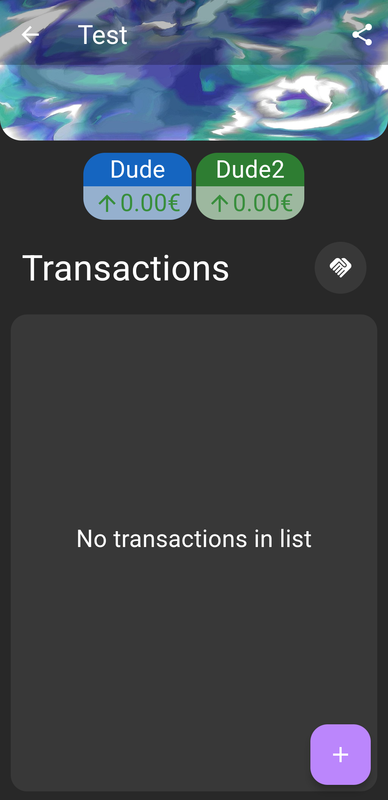
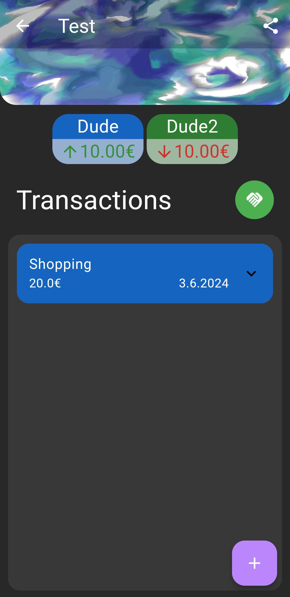
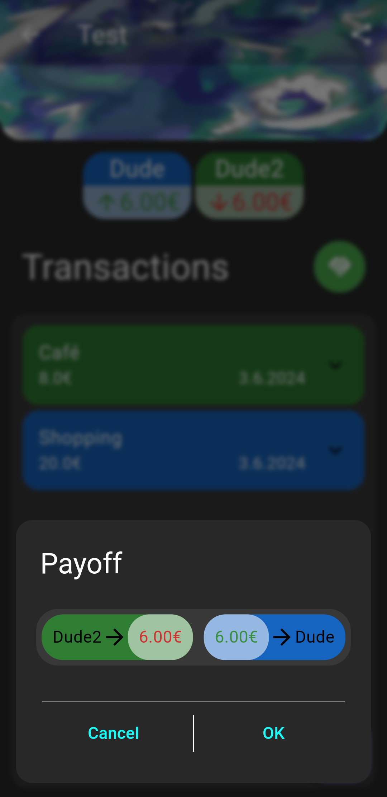
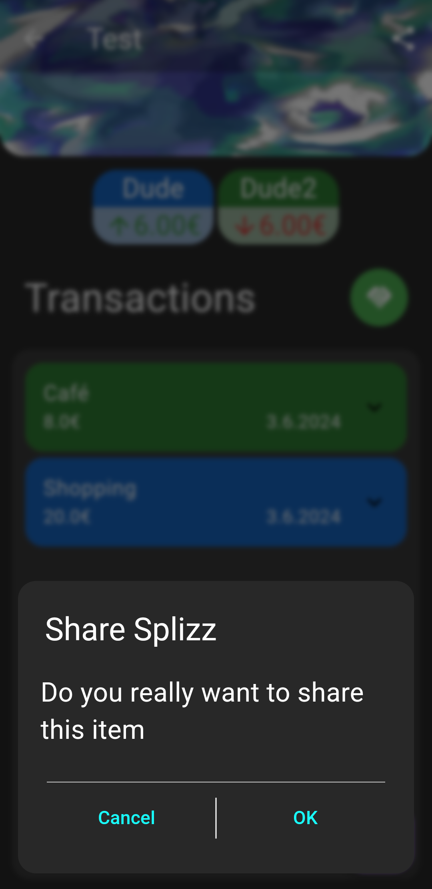

# splizz
Splizz is a simple cross platform application to split costs between friends. It uses flutter with Sqlite as database backend and is intended offline first.\
To sync the transactions and allow editing from multiple devices, Google Drive with it's native ability to share files with other people, is used. The data is stored in json files.
This makes an account creation unnecessary, but requires a Google account.\
Other cloud storage providers as well as a native possibility to sync (via supabase) are also planned.

The current alpha is available on [Google Play](https://play.google.com/store/apps/details?id=de.tmc.splizz)

|  |  |  |  |  |  |   
|:--:|:--:|:--:|:--:|:--:|:--:|
|  |  |  |  |  |  |  